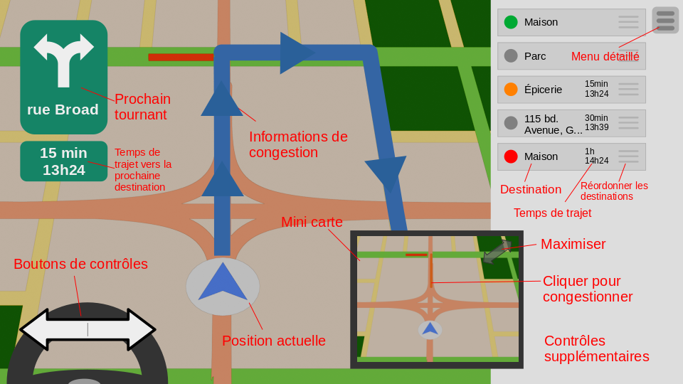

<span>
<h1 style="border: 2px solid black; text-align: center">RAPPORT FINAL - TRAFFIX</h1>

<br>
<br>
<br>
<br>
<br>
<br>
<br>

<h2 style="text-align: center">UNIVERSITÉ DU QUÉBEC EN OUTAOUAIS</h2>

<br>
<br>
<br>
<br>
<br>
<br>
<br>
<br>
<br>
<br>
<br>
<br>
<br>

<p style="text-align: center">Travail de session</p>
<p style="text-align: center">présenté à</p>
<h3 style="text-align: center"><b>Ilham Benyahia</b></h3>
<p style="text-align: center">par</p>
<h4 style="text-align: center">Vincent Godbout, Gaetan Edith  Mpessa Lobe, Boris Manfouo Nzoé, Serigne Fallou Diop, Moussa Camara et Astrid Yvan Kamto Fondop</h4>

<br>
<br>
<br>
<br>
<br>
<br>
<br>
<br>
<br>
<br>
<br>
<br>

<p style="text-align: center">Département d'Informatique</p>
<br>
<p style="text-align: center">INF1573</p>
<p style="text-align: center">01</p>
<br>
<p style="text-align: center">Gatineau</p>
<p style="text-align: center">Date de remise [29/04/25]</p>
</span>

# Table des matières

0. [Phase de préparation - Organisation de l'équipe](#0-phase-de-préparation---organisation-de-léquipe)
   1. [Rôles d'organisation](#01-rôles-dorganisation)
   2. [Rôles de programmation](#02-rôles-de-programmation)
1. [Phase 1 : Analyse et Spécifications](#1-phase-1--analyse-et-spécifications)
   1. [Description générale du système](#11-description-générale-du-système)
   2. [Liste des spécifications fonctionnelles](#12-liste-des-spécifications-fonctionnelles)
   3. [Exemple d’utilisation](#13-exemple-dutilisation)
   4. [Schéma fonctionnel global du système](#14-schéma-fonctionnel-global-du-système)
   5. [Maquette de l'interface](#15-maquette-de-linterface)
2. [Phase 2 - Modélisation du programme](#2-phase-2---modélisation-du-programme)
   1. [Identification des classes](#21-identification-des-classes)
   2. [Tableau des classes](#22-tableau-des-classes)
   3. [Diagramme UML](#23-diagramme-uml)
   4. [Diagramme de flux de A*](#24-diagramme-de-flux-de-a)
3. [Phase 3 - Résultat de la phase de programmation](#3-phase-3---résultat-de-la-phase-de-programmation)
   1. [Résultat de l'interface utilisateur](#31-résultat-de-linterface-utilisateur)
   2. [Organisation du répertoire](#32-organisation-du-répertoire)
      1. [Dossier racine ( `./` )](#321-dossier-racine---)
      2. [`devoir/`](#322-devoir)
      3. [`app/build/`](#323-appbuild)
         1. [`app/build/distributions/`](#3231-appbuilddistributions)
         2. [`app/build/reports/`](#3232-appbuildreports)
      4. [`app/src/lib/`](#324-appsrclib)
      5. [`app/src/tests`](#325-appsrctests)
      6. [`app/src/main/ressources/`](#326-appsrcmainressources)
      7. [`app/src/main/java/org/Traffix/`](#327-appsrcmainjavaorgtraffix)
   3. [Bibliothèques utilisées](#33-bibliothèques-utilisées)
   4. [Fonctionnement Général](#34-fonctionnement-général)
      1. [Initialisation](#341-initialisation)
      2. [Boucle principale](#342-boucle-principale)
4. [Phase 4 - Révision et Test du programme](#4-phase-4---révision-et-test-du-programme)
   1. [Utilisation de JUnit](#41-utilisation-de-junit)
   2. [Approche de programmation de qualité](#42-approche-de-programmation-de-qualité)
   3. [Approche de tests intégrés](#43-approche-de-tests-intégrés)
   4. [Utilisation d'outils de contrôle de version](#44-utilisation-doutils-de-contrôle-de-version)
5. [Bibliothèques et sources](#5-bibliothèques-et-sources)

note : ce rapport incorpore les textes des autres fichiers présents dans ce dossier <br>
[lien vers le répôt github](https://github.com/gyoo18/Traffix)

<br>
<br>
<br>
<br>
<br>
<br>
<br>
<br>
<br>
<br>
<br>
<br>
<br>
<br>
<br>
<br>
<br>
<br>

# 0. Phase de préparation - Organisation de l'équipe

## 0.1. Rôles d'organisation

Rôles organisationnels

| Nom              |            Rôle               |  Description  |
|:----------------:|:-----------------------------:|:--------------|
| Vincent          | Communications<br>& direction | S'occupe de la communication officielle avec la professeure et mène la direction du projet.<br>Ceci implique :<br>- Les questions, la remise, etc. sont exécutés par lui.<br>- Il a le dernier mot sur les grandes orientations du projet.<br>- Il prend la décision finale sur les choix qui font débats.<br>- Responsable de la qualité du code et du respect des consignes.|
| Gaetan           | Coordonnateur                 | S'occupe du calendrier.<br>Ceci implique :<br>- Il est responsable de la création et du suivit des dates butoirs.<br>- Il est responsable de la coordination des horaires pour l'arrangement des rencontres.|
| Astrid<br>Moussa | Tests                         | Responsables des tests.<br>Ceci implique:<br>- Mise en place, gestion et maintenance des tests unitaires.<br>- Communications fréquentes sur l'état des résultats de tests|
| Serigne<br>Boris | Documentation                 | Responsable de la documentation du code.<br>Ceci implique:<br>- Maintenance des commentaires, des Javadocs et du document de référence.<br>- Responsable de la clarification des confusions internes|

**Précision :** *TOUT LE MONDE PROGRAMME*
<br>
<br>
<br>

## 0.2. Rôles de programmation

Qui code quoi?  *Cette section n'a malheureusement pas pue être remplie*

| Fonctionnalité | Personne à charge | Date butoir |  À faire  | En cours | Terminé |
|:--------------:|:-----------------:|:-----------:|:---------:|:--------:|:-------:|
| Exemple        |      Vincent      |  13 avril   |    [_]    |    [X]   |   [_]   |

<br>
<br>
<br>
# 1. Phase 1 : Analyse et Spécifications

## 1.1. Description générale du système

Le projet consiste à développer un système de navigation GPS intelligent en Java, doté d’une interface graphique Swing, capable de :
- Visualiser un réseau routier dynamique (routes, intersections, état du trafic),
- Guider en temps réel un véhicule jusqu’à sa destination,
- Réagir automatiquement à des événements tels que la congestion ou les accidents en recalculant l’itinéraire optimal.
Le système vise à offrir une expérience de navigation fluide, précise et réactive, en utilisant une approche orientée objet.

## 1.2. Liste des spécifications fonctionnelles
- Système de réseau routier : représentation graphique des routes et intersections sous forme de graphe.
- Système de création de réseau : possibilité de construire manuellement ou automatiquement un réseau routier.
- Interface graphique (Swing) : affichage clair de la carte, de la position du véhicule et des indications GPS.
- Système de navigation : calcul du chemin optimal entre deux points à l’aide de Dijkstra ou A*.
- Guidage en temps réel : instructions précises (« Tournez à droite », « Continuez tout droit ») en fonction de la position du véhicule.
- Réaction aux événements : recalcul automatique de l’itinéraire en cas d’obstacle ou de congestion.
- Système de gestion de congestion : détection et affichage des zones impactées, et impact sur le calcul d’itinéraire.

## 1.3. Exemple d’utilisation
1. L'utilisateur sélectionne une destination sur la carte.
2. Le GPS calcule le meilleur chemin.
3. Le véhicule commence son trajet avec un affichage temps réel des instructions.
4. Une congestion survient sur la route.
5. Le système détecte l'événement, met à jour l'état du graphe routier et recalcule un itinéraire.
6. Le GPS affiche de nouvelles instructions et redirige le véhicule.

<br>


### 1.4. Schéma fonctionnel global du système


### 1.5. Maquette de l'interface

# 2. Phase 2 - Modélisation du programme

## 2.1. Identification des classes

- Réseau routier
  - Graphe représentant les routes du réseau.
  - Contient des intersections reliées par des routes

- Intersection
  - Relie plus d'une route entre elles et s'occupe de transférer les véhicules d'une intersection à l'autre.
  - Référence de routes.
  - Possède une position physique.
  - Gère le traffic.

- Route
  - Relie deux intersections et s'occupe de faire naviguer les véhicules sur sa longueur
  - Possède deux intersections
  - Possède une longueur
  - À des fins de simplicités, ne possède qu'une voie.
  - Possède une vitesse maximale
  - Possède un nom
  - Possède des numéros de rue sur sa longueur
  - Référence aux voitures

- Véhicule
  - Se promène sur le réseau routier selon sa routine habituelle pour causer de la congestion.
  - Possède une longueur
  - Possède une destination cible
  - Possède une liste de destinations en fonction de l'heure de la journée pour former une routine
  - Possède un navigateur

- Système de recherche de chemin
  - Communique avec le réseau routier pour trouver le chemin le plus rapide, le plus court ou le moins énergivore entre deux points sur le réseau.

- Navigateur (Système de navigation automatique)
  - Communique avec le système de recherche de chemin, le véhicule et le réseau routier pour trouver et exécuter le chemin le plus court, en fonction des voitures environnantes.

- Système de contrôle du véhicule
  - Système qui reçoit les événements du GUI pour contrôler un véhicule spécialisé pour le contrôle de l'utilisateur.

- Système de GUI avec swing
  - Système qui implémente les objets swing et contient l'interface graphique. Reçoit et traite les événements et appelle les fonctions nécessaires à l'exécution de la logique du système.

- Système de traitement des événements d'interaction
  - Système qui s'accroche au GUI pour écouter les événements d'interraction utilisateur, les traiter et appeler les fonctions nécessaires à leurs exécutions.

- Système de création et de gestions d'événements aléatoires
  - Responsable de créer des accidents, des ralentissements, des blocages de la construction, etc. et d'en gérer leur évolution

- Système de traitement des informations
  - Communique avec le système de GUI et le réseau routier pour aller chercher les informations nécessaires à l'affichage et les traduire pour l'affichage

- Système de génération de réseau routier
  - Créé un réseau aléatoirement au démarrage du programme et créé les routines des véhicules.

- *(Potentiel)* Système de représentation routier
  - Il se peut que swing ne soit pas suffisant pour représenter le réseau routier ou la vue GPS. Il se peut qu'un système séparé pour cette fin soie nécessaire. Le système de GUI le posséderait et le traiterait comme une composante swing.

## 2.2 Tableau des classes

| Classe                    | Responsabilité & description                                                                                                              | Attributs principaux                                                                                                                                                      | Méthodes essentielles                                                                                                                                                                                                                                                                                                                                                                                    |
|:--------------------------|:------------------------------------------------------------------------------------------------------------------------------------------|:--------------------------------------------------------------------------------------------------------------------------------------------------------------------------|:---------------------------------------------------------------------------------------------------------------------------------------------------------------------------------------------------------------------------------------------------------------------------------------------------------------------------------------------------------------------------------------------------------|
| Réseau                    | Représente un réseau routier                                                                                                              | listeRoutes <br> listeIntersections                                                                                                                                       | `avoirPosition(Adresse)` → une position en fonction d'une adresse <br> `avoirAdresse(Position)` → une adresse en fonction d'une position                                                                                                                                                                                                                                                                 |
| Route                     | Représente un tronçon de route                                                                                                            | nom <br> longueur <br> vitesseMax <br> intersectionA <br> intersectionB <br> queueVéhiculesSensA <br> queueVéhiculeSensB <br> listeAdresses <br> ralentissementArtificiel | `avoirPosition(NuméroRue)` → la position du numéro de rue et `Null` si ne possède pas <br> `avoirAdresse(Position)` → l'adresse la plus proche de la position <br> `avoirVitesseMoyenne(Sens)` → avoir la vitesse moyenne actuelle des voitures roulant dans ce sens <br> `estAccessible()` → indique si une voiture peut s'y engager <br> `ajouterVéhicule(Véhicule,Sens)` <br> `retirerVéhicule(Sens)` |
| Intersection              | Classe Abstraite représentant la jonction entre 3+ routes                                                                                 | listeRoutes <br> position                                                                                                                                                 | `miseÀJour()` : met à jour l'état de l'intersection <br> `peutPasser(RouteDépart, RouteDestination)` → indique si un véhicule est authorisé à traverser l'intersection                                                                                                                                                                                                                                   |
| IntersectionFeux          | Intersection qui utilise la logique des feux de circulation pour gérer le traffic                                                         | tempsCycleFeux <br> duréeCycleFeux                                                                                                                                        |                                                                                                                                                                                                                                                                                                                                                                                                          |
| IntersectionArrêt         | Intersection qui utilise la logique des paneaux d'arrêts pour gérer le traffic                                                            |                                                                                                                                                                           |                                                                                                                                                                                                                                                                                                                                                                                                          |
| IntersectionLaissezPasser | Intersection qui utilise la logique de voies prioritaires pour gérer le traffic                                                           | listeEstVoiePrioritaire (booléen décrivant si chaque route est prioriaire ou non)                                                                                         |                                                                                                                                                                                                                                                                                                                                                                                                          |
| Véhicule                  | Représente un véhicule se déplaçant sur la route                                                                                          | longueur <br> position <br> vitesse <br> routeActuelle <br> navigateur                                                                                                    |                                                                                                                                                                                                                                                                                                                                                                                                          |
| AÉtoile                   | Classe statique implémentant l'algorithme A*                                                                                              |                                                                                                                                                                           | `chemin(PositionA\|AdresseA, PositionB\|AdresseB)` → un chemin à prendre pour traverser le réseau routier, du point A au point B                                                                                                                                                                                                                                                                         |
| Navigateur                | Composante du véhicule qui exécute ses déplacements                                                                                       | destinationActuelle <br> routineListeDestinations <br> cheminActuel                                                                                                       | `miseÀJour()` : avance le véhicule sur son chemin, s'il le peut et avance à travers l'intersection si nécessaire                                                                                                                                                                                                                                                                                         |
| NavigateurManuel          | Hérite de Navigateur et agit comme interface entre l'utilisateur et l'intersection                                                        | listeActionsUtilisateur                                                                                                                                                   | `ajouterAction(Action)` : ajoutes une action utilisateur à la liste des actions à effectuer                                                                                                                                                                                                                                                                                                              |
| GestionnaireAccidents     | Classe statique responsable de la création et de la gestion d'événements aléatoires, comme des accidents de la construction, etc.         | listeAccidents <br> listeTempsAccidents <br> listeDuréeAccidents                                                                                                          | `miseÀJour()` : créée, détruit, gère et applique les accidents                                                                                                                                                                                                                                                                                                                                           |
| Fenêtre                   | Représente une fenêtre utilisateur. Contient le GUI.                                                                                      | *(liste des composantes swings nécessaires)*                                                                                                                              | `miseÀJour()` : met à jour touts les composants swings nécessaires <br> `avoirComposantParID(ID)` → un composant swing en fonction d'un ID                                                                                                                                                                                                                                                               |
| GestionnaireInfos         | Classe statique responsable de la collecte et du traitement des informations pour l'affichage                                             | *(N'est pas responsable du stockage de cette information)*                                                                                                                | `miseÀJour()` : collecte et traites toutes les informations nécessaires à l'affichage                                                                                                                                                                                                                                                                                                                    |
| GestionnaireContrôles     | Classe statique qui se connecte à la fenêtre afin de collecter les événements d'interactions, les traiter et appeler les bonnes fonctions | trajetDestinationMaintenueID                                                                                                                                              | `initialisation()` : met en place tout les eventListeners nécessaires, qui appelleront les méthodes de traitements suivantes : <br> `surMouvementSouris()` <br> `surTournantDroit()` <br> `surTournantGauche()` <br> `surAccélère()` <br> `surFreine()` <br> `surMiniCarteAgrandie()` <br> `surMiniCarteRapetissée()` <br> `surMiniCarteClic()` <br> `surTrajetParamètresOuvrir()` <br> `surTrajetParamètresFermer()` <br> `surTrajetDestinationClic(ID)` : appelé lorsqu'une destination est sélectionnée pour être réordonnée <br> `surTrajetDestinationRelâché()` <br> `surTrajetDestinationMaintenueMouvementSouris()` : apelée par `surMouvementSouris()` <br> `surParamètresOuvrir()` <br> `surParamètresFermer()` <br> etc...|
| UsineFenêtre              | Classe statique qui crée les fenêtres voulues                                                                                             |                                                                                                                                                                           | `avoirGPS()` → la fenêtre principale qui représente l'interface GPS <br> `avoirParamètres()` → la fenêtre des paramètres                                                                                                                                                                                                                                                                                 |
| UsineRéseau               | Classe statique qui crée et initialise le réseau routier                                                                                  |                                                                                                                                                                           | `créerRéseau()` → un réseau routier généré aléatoirement                                                                                                                                                                                                                                                                                                                                                 |
| ***(Potentiel)***         | Assortiment de classes OpenGL permettant de visualiser le réseau routier.                                                                 |                                                                                                                                                                           |                                                                                                                                                                                                                                                                                                                                                                                                          |


### 2.3. Diagramme UML


### 2.4 Diagramme de flux de A*

# 3. Phase 3 - Résultat de la phase de programmation

Le projet est aussi disponible sur [Github](https://github.com/gyoo18/Traffix)

## 3.1. Résultat de l'interface utilisateur


Lors de l'ouverture du programme, vous serez présenté avec l'image ci-haut.
1. L'utilisation du programme consiste à naviguer à travers un réseau routier généré procéduralement à l'aide d'un GPS. Vous pouvez voir votre voitre au centre, ainsi que les voitures qui vous accompagnent autour.
2. Des boutons de navigations vous sont offerts en bas à gauche de l'écran. Vous pouvez accélérer, ralentir, tourner à gaucher, tourner à droite et faire demi-tour. Ces boutons sont aussi disponible sur votre clavier, il suffit simplement d'utiliser les flèches et la barre d'espace.
3. Une minicarte vous est présenté. Vous pouvez zoomer/dézoomer en utilisant la molette de la souris. Le haut de la carte pointera toujours dans votre direction de voyage.
4. Vous pouvez maximiser/minimiser la minicarte afin d'avoir un meilleur apperçu des alentours.
5. Une barre de recherche vous est offerte afin de marquer votre itinéraire. L'utilisation de plusieurs destinations est supportée. *Vous devez cliquer sur le bouton « rechercher » à droite afin de confirmer votre destination*.


1. Vous pouvez minimiser la minicarte après l'avoir maximisé.
2. Vous pouvez cliquer sur la carte afin de sélectionner votre destination. Cette action remplira la barre de recherche, comme montré plus bas, afin que vous puissiez confirmer votre destination en appuyant sur le bouton de recherche. De plus, si vous cliquez avec le bouton `Ctrl` enfoncé, vous pourrez créer un accident à l'endroit de votre clic.


Une fois la destination confirmée, vous aurez accès à votre itinéraire :


1. Une carte résumant votre destination est apparue sous la barre de recherche. Elle comporte plusieurs éléments d'information : 
   1. La couleur du cercle indique le type de destination : Vert indique départ, Orange indique un arrêt en chemin et Rouge la destination finale.
   2. L'adresse de la destination
   3. La durée du trajet et l'heure d'arrivée
2. 4. Un bouton pour supprimer la destination
   5. En cliquant sur le bouton de réordonnancement, vous pourrez glisser les cartes pour réorganiser votre itinéraire. Ces changements prendront effets immédiatement et vous pourrez commencer à suivre le trajet sans tarder.
3. Vous pouvez observer votre trajet en bleu sur la route devant vous et sur la minicarte. Il se mettra à jour automatiquement, réagissant à la congestion, aux accidents et à vos propres décisions.
4. Des indications de trajets se trouvent en haut à gauche. Une flèche indique le prochain tournant, ainsi que le nom de la prochaine rue, et une boîte d'indication affiche le temps restant avant d'atteindre la prochaine destination ainsi que l'heure d'arrivée.


1. On peut observer sur les deux images ci-dessus, des zones d'accidents qui ralentissent les véhicules par un certain pourcentage. Leur couleur rouge foncé indiquent la gravité de l'accident, le plus foncé indiquant les accidents qui ralentissent le plus.
2. On peut observer que lorsque le véhicule pénètre une zone d'accident, des informations à son propos s'affichent en dessous des informations de temps de trajet, à gauche.
3. Vous pouvez à tout moment faire `Ctrl+clic` sur la carte afin de créer un nouvel accident.

## 3.2. Organisation du répertoire

Ce projet utilise [Gradle](https://gradle.org/) comme outil de build.

Prévisualisation de l'arbre des dossiers:

```text
.
├── app
│   ├── build - - - - - - - Dossier généré par gradle
│   │   ├── distributions
│   │   │   ├── app.tar   - fichiers compressé contenants les exécutables
│   │   │   └── app.zip
│   │   ├── reports/tests/test/
│   │   │   ├── index.html - Page html indiquant les rapports d'exécution des tests
│   │   │   └── tests/...
│   │   ...
│   ├── build.gradle - fichier de configuration gradle
│   └── src
│       ├── lib
│       │   └── lwjgl-awt/... - Bibliothèque utilisée pour lier lwjgl (ou OpenGL) et awt (ou Swing)
│       ├── main - - - - - - - - Code source
│       │   ├── java/org/Traffix/
│       │   │   ├── App.java
│       │   │   ├── animations
│       │   │   │   ├── Animable.java
│       │   │   │   ├── FonctionFinAnimation.java
│       │   │   │   └── GestionnaireAnimations.java
│       │   │   ├── circulation
│       │   │   │   ├── AÉtoile.java
│       │   │   │   ├── GestionnaireAccidents.java
│       │   │   │   ├── IntersectionArrêt.java
│       │   │   │   ├── IntersectionFeux.java
│       │   │   │   ├── Intersection.java
│       │   │   │   ├── IntersectionLaissezPasser.java
│       │   │   │   ├── Navigateur.java
│       │   │   │   ├── NavigateurManuel.java
│       │   │   │   ├── Réseau.java
│       │   │   │   ├── Route.java
│       │   │   │   ├── UsineRéseau.java
│       │   │   │   └── Véhicule.java
│       │   │   ├── GUI
│       │   │   │   ├── Bouton.java
│       │   │   │   ├── Destination.java
│       │   │   │   ├── Fenêtre.java
│       │   │   │   ├── GestionnaireContrôles.java
│       │   │   │   ├── GestionnaireInfos.java
│       │   │   │   ├── RoundPane.java
│       │   │   │   ├── TexteEntrée.java
│       │   │   │   └── UsineFenêtre.java
│       │   │   ├── maths
│       │   │   │   ├── Mat4.java
│       │   │   │   ├── Maths.java
│       │   │   │   ├── Transformée.java
│       │   │   │   ├── Vec2.java
│       │   │   │   ├── Vec3.java
│       │   │   │   └── Vec4.java
│       │   │   ├── OpenGL
│       │   │   │   ├── Caméra.java
│       │   │   │   ├── GénérateurMaillage.java
│       │   │   │   ├── GLCanvas.java
│       │   │   │   ├── Maillage.java
│       │   │   │   ├── Nuanceur.java
│       │   │   │   ├── Objet.java
│       │   │   │   ├── Scène.java
│       │   │   │   └── Texture.java
│       │   │   └── utils
│       │   │       ├── Chargeur.java
│       │   │       └── Octarbre.java
│       │   └── resources - - - - - Fichiers non-java chargés lors de l'exécution
│       │       ├── nuanceurs - - - Programmes s'exécutants sur le GPU ("Shaders")
│       │       │   ├── nuaColoré.frag
│       │       │   ├── nuaColoréPoints.frag
│       │       │   ├── nuaColoréPoints.vert
│       │       │   └── nuaColoré.vert
│       │       └── textures
│       │           ├── continuer.png
│       │           ├── demi-tour.png
│       │           ├── tourner-droite_-45.png
│       │           ├── tourner-droite_45.png
│       │           ├── tourner-droite_90.png
│       │           ├── tourner-gauche_-45.png
│       │           ├── tourner-gauche_45.png
│       │           └── tourner-gauche_90.png
│       └── test - - - - - - - - - - - - - - - - tests JUnits
│           └── java
│               └── org
│                   └── Traffix
│                       └── circulation
│                           ├── AÉtoileTest.java
│                           ├── Communs.java
│                           ├── IntersectionArrêtTest.java
│                           └── IntersectionLaissezPasserTest.java
│
├── devoir - - - - - - - Dossier contenant les fichiers reliés à la remise du devoir
│   ├── Calendrier.md
│   ├── Calendrier.png
│   ├── Diagrammes.drawio
│   ├── FluxA_.drawio.svg
│   ├── Maquette_1.png
│   ├── Modélisation.md
│   ├── Organisation.md
│   ├── Schéma_fonctionnel.svg
│   ├── Spécifications.md
│   └── UML.svg
├── gradle/... - - - - - - - Dossier d'exécution de gradle
├── gradle.properties
├── gradlew - - - - - - - -  Scripts d'interface gradle agnostics à la machine
├── gradlew.bat - - /
├── README.md - - - - - - -  Le présent fichier de présentation
└── settings.gradle - - - -  Fichier de configuration général gradle
```

---

### 3.2.1. Dossier racine ( `./` )

Dossier racine. Contient quelques fichiers importants:
- **README.md** le présent *README*.
- **settings.gradle** Paramètre de configurations globales de gradle.
- **gradlew** et **gradlew.bat** Script d'interface CLI avec gradle, afin d'être agnostic à la machine.
- **.git/** Dossier contenant toutes les informations concernant le répôt git.
- **gradle/** Dossier de fonctionnement de gradle

### 3.2.2. `devoir/`

Dossier contenant tout les fichiers relatifs à la remise du devoir, soit les rapports, les diagrammes, etc.

### 3.2.3. `app/build/`

À la première ouverture du projet, ce dossier n'existera pas. Il est créé par gradle à l'exécution des commandes ci-dessus. Il comporte quelques dossiers intéressants :

#### 3.2.3.1. `app/build/distributions/`

Contient les fichiers compressés pour l'exécution du programme. Ils sont présents sous forme de `.zip` et de `.tar` et possèdent la structure suivante :

```text
Traffix.zip
└── app
    ├── lib/... - Contient tout les fichiers exécutables java (les .jar)
    └── bin
        ├── app.bat - Scripts de démarrages de l'application
        └── app
```

#### 3.2.3.2. `app/build/reports/`

Contient le rapport d'exécution des tests, visionnable sous forme de page html, en ouvrant le fichier [indexe.html](./app/build/reports/tests/test/index.html) dans un navigateur web.

### 3.2.4. `app/src/lib/`

Gradle se charge de gérer les bibliothèques communes afin d'éviter d'avoir à télécharger une bibliothèque si un ordinateur la possède déjà et afin de diminuer la taille du répôt. Cependant, certaines bibliothèques ne sont pas disponibles aussi facilement en ligne et nécessitent d'être inclues directement dans le projet. Dans notre cas, il nous a été nécessaire d'inclure `lwjgl-awt` pour faire l'interface entre `LWJGL` (ou OpenGL) et `AWT` (ou Swing).

### 3.2.5. `app/src/tests`

Contient les tests JUnits qui testent les fonctionnalités du projet. Lors de la compilation, Gradle exécute ces tests automatiquement. Nous aurions aimés mieux fournir cette section, mais le temps nous a manqué.

### 3.2.6. `app/src/main/ressources/`

Contient les fichiers ressources qui doivent être chargés en mémoire à l'exécution du programme. Ce dossier inclut toutes les images utilisés dans le programme et tout les fichiers de nuanceurs OpenGL.

### 3.2.7. `app/src/main/java/org/Traffix/`

Package contenant le code source du devoir. La fonction `main()` se trouve dans `App.java`. Le projet est divisé en 6 sous-dossiers :
- **GUI/** Contient toutes les classes qui interragissent avec Swing
- **OpenGL/** Contient toutes les classes qui interragissent avec OpenGL, notamment GLCanvas, qui est responsable du dessin sur un `AWTGLPanel`.
- **circulation/** Contient toutes les classes responsables de la représentation du réseau routier et des véhicules
- **maths/** Contient une suite de classes et de fonctions utilitaires mathématiques pour utiliser OpenGL. Ce code a été réutilisé et perfectionné d'un autre projet d'un des membres de l'équipe, que vous pouvez voir [ici](https://github.com/gyoo18/Battleship/).
- **utils/** Contient quelques classes utilitaires, comme un chargeur de fichier. Ce code a aussi été tiré du projet mentionné ci-haut.
- **animations/** Relique du projet mentionné ci-haut. Permet de créer des transitions simples entre plusieurs clés d'animations. Nous pensions l'utiliser pour ce projet, mais son utilité ne s'est pas avéré.

## 3.3. Bibliothèques utilisées
- [Java Swing](https://docs.oracle.com/javase/8/docs/api/javax/swing/package-summary.html) Pour l'interface graphique et les événements d'interaction utilisateur
- [LightWeight Java Game Library (LWGL)](https://www.lwjgl.org/) pour l'interface avec OpenGL
- [lwjgl-awt](https://github.com/LWJGLX/lwjgl3-awt) pour faire interface entre LGJWL 3 et AWT.
- Utilisation de [Gradle](https://gradle.org/) pour la compilation et la gestion des dépendances
- Utilisaton de [JUnit](https://junit.org/junit5/) pour les tests unitaires
- Merci à [Jonas K](https://stackoverflow.com/users/1640501/jonas-k) sur StackOverflow pour son algorithme pour [déterminer si un String est un nombre](https://stackoverflow.com/questions/237159/whats-the-best-way-to-check-if-a-string-represents-an-integer-in-java)

## 3.4. Fonctionnement Général


### 3.4.1. Initialisation

La classe `UsineFenêtre` génère une fenêtre qui fait l'interface avec un `JFrame` Swing. L'intention était de pouvoir obtenir plusieurs fenêtre interchangeables en fonction du menu, mais le temps nous a manqué. 

`UsineRéseau` génère un `Réseau` routier composé de `Route`, d'`Intersection` et de `Véhicule` avec un algorithme de pousse en branches. Il commence par faire pousser des Autoroutes, puis il fait pousser des Boulevards depuis les Autoroutes et finalement des petites rues. Comme cette structure mime la croissance des plantes, il en résulte un réseau à l'allure organique. Cependant, cette approche mène souvent à des erreurs de génération difficiles à retracer. C'est pourquoi un test de validité est exécuté à la fin de la génération et la recommence s'il échoue afin d'assurer un réseau valide.

Les deux classes sont utilisés pour initialiser `GestionnaireContrôles`, `GestionnaireInfos`, `AÉtoile` et `GestionnaireAccidents`.

Les objets OpenGL sont initialisés. Il est à noter que la vue principale et la mini carte possèdent deux contextes OpenGL différents, ce qui implique qu'ils ne peuvent pas se partager les ressources et qu'elles doivent être dupliqués pour les deux instances.

### 3.4.2. Boucle principale

1. Le réseau est mis à jour
   1. Chaque **véhicule** sur le réseau est mis à jour. Ceci implique l'avancement du mouvement, la mise à jour de l'arbre de décision, l'exécution des commandes de l'utilisateur et le recalcul de l'itinéraire au besoin.
   2. Les **intersections** sont mises à jour. Ceci affecte les `IntersectionArrêt` et `IntersectionFeux`, quoique cette dernière n'est pas utilisée.
2. Le `GestionnaireAccidents` est mis à jour. Cela implique la création et la destruction d'accidents.
3. Le `GestionnaireInfo` est mis à jour. Cela implique la collecte de données sur le réseau et la modifications des composantes Swing nécessaires
4. La caméra est mise à jour.

Le système de dessin à l'écran est géré par Swing dans son propre fil d'exécution, ce qui implique que la boucle de dessin OpenGL n'est pas contrôlable.

La gestion des événements se fait à travers le `GestionnaireContrôles`. Il reçoit et exécute les événements afin d'envoyer les bonnes commandes aux bons endroits et de modifier les valeurs correctement.

# 4. Phase 4 - Révision et Test du programme

Malheureusement, la phase de programmation a déjà pris bien trop de temps, ainsi il ne nous en reste plus pour la phase de révision et de test. Cependant,
Il reste que cette phase n'a pas été oubliée dans l'organisation du reste du projet : 

## 4.1 Utilisation de JUnit

L'utilisation de Gradle nous a permis d'inclure rapidement et sans efforts des tests unitaires à l'aide de JUnit. Ces tests peuvent être vus sous 
`app/src/test/java/org/Traffix/circulation` et ont été cruciaux pour une partie de la phase de débogage pour la phase de programmation. Cependant,
il est vrais que seule une partie du système est couverte par les jeux de tests et nous aurions aimés pouvoir en faire davantage.

## 4.2 Approche de programmation de qualité

Afin de maximiser la compréhension et la qualité du code, tout en minimisant la quantité de travail à y mettre, la documentation a été prise en compte
dans l'écriture du code. C'est-à-dire que les noms de variables et de fonctions ont soigneusements été choisis afin de se documenter eux-même et minimiser
la quantité de commentaires nécessaire. Ainsi, un effort accru a été passé à s'assurer que le programme était facilement lisible.

## 4.3 Approche de tests intégrés

Durant la phase de programmation, des pauses ont régulièrements été prises afin de tester plusieurs fonctionalités dans plusieurs situations. Bien que ces
tests ne soient pas systématiques et automatiques, ils sont tout de même essentiel pour assurer le bon fonctionnement du système et ont mené à un code
fonctionnel.

## 4.4 Utilisation d'outils de contrôle de version

L'utilisation de Git et Github ont permis une collaboration aisée, car chacun pouvait modifier sa version du programme sans craindre de briser un système essentiel
et tout en ayant la paix d'esprit de savoir qu'il serait toujours facile et rapide de revenir en arrière au cas où une nouvelle fonctionnalité ne fonctionne pas.
De plus, afin d'assurer un contrôle de qualité la branche main a été bloqué d'avance, de façon à ce que seul un processus de révision par les collègue puisse permettre
une modification. Cela implique qu'aucun code n'a été poussé vers la version finale sans avoir été révisé.

# 5. Bibliothèques et sources

- [Java Swing](https://docs.oracle.com/javase/8/docs/api/javax/swing/package-summary.html) Pour l'interface graphique et les événements d'interaction utilisateur
- [LightWeight Java Game Library (LWGL)](https://www.lwjgl.org/) pour l'interface avec OpenGL
- [lwjgl-awt](https://github.com/LWJGLX/lwjgl3-awt) pour faire interface entre LGJWL 3 et AWT.
- Utilisation de [Gradle](https://gradle.org/) pour la compilation et la gestion des dépendances
- Utilisaton de [JUnit](https://junit.org/junit5/) pour les tests unitaires
- Utilisation de [Git](https://git-scm.com/) pour le contrôle de version et la collaboration
- Utilisation de [Github](https://github.com/) comme serveur git pour la collaboration.
- Merci à [Jonas K](https://stackoverflow.com/users/1640501/jonas-k) sur StackOverflow pour son algorithme pour [déterminer si un String est un nombre](https://stackoverflow.com/questions/237159/whats-the-best-way-to-check-if-a-string-represents-an-integer-in-java)

---

Je (Vincent Godbout) déclare qu'aucune utilisation de l'intelligence artificielle n'a été faite pour écrire le présent rapport. Je déclare ne pas avoir utilisé l'IA sous 
quelque forme que ce soit pour rédiger ou concevoir le présent programme. Je déclare que l'utilisation de l'IA que j'ai faite se limite à de l'aide de compréhension. 
Je déclare ne pas être au courant de toute utilisation d'IA faites au cours de ce projet, par moi ou par mes collègues, qui puisse enfreindre les lois et règlements sur le plagiat.