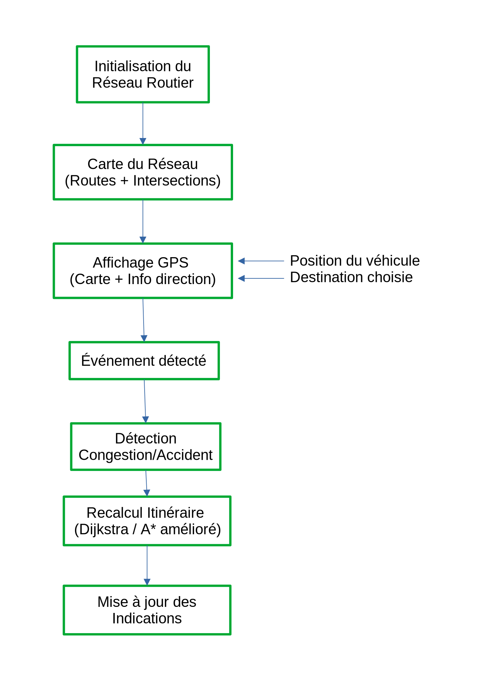

<h1 style="text-align:center; padding: 0.1em; border: 2px solid black">TRAFFIX</h1>

<h2 style="text-align: center">TRAFFIX - Phase 1 : Analyse et Spécifications<h2>

### 1. Description générale du système
Le projet consiste à développer un système de navigation GPS intelligent en Java, doté d’une interface graphique Swing, capable de :
- Visualiser un réseau routier dynamique (routes, intersections, état du trafic),
- Guider en temps réel un véhicule jusqu’à sa destination,
- Réagir automatiquement à des événements tels que la congestion ou les accidents en recalculant l’itinéraire optimal.
Le système vise à offrir une expérience de navigation fluide, précise et réactive, en utilisant une approche orientée objet.

### 2. Liste des spécifications fonctionnelles
- Système de réseau routier : représentation graphique des routes et intersections sous forme de graphe.
- Système de création de réseau : possibilité de construire manuellement ou automatiquement un réseau routier.
- Interface graphique (Swing) : affichage clair de la carte, de la position du véhicule et des indications GPS.
- Système de navigation : calcul du chemin optimal entre deux points à l’aide de Dijkstra ou A*.
- Guidage en temps réel : instructions précises (« Tournez à droite », « Continuez tout droit ») en fonction de la position du véhicule.
- Réaction aux événements : recalcul automatique de l’itinéraire en cas d’obstacle ou de congestion.
- Système de gestion de congestion : détection et affichage des zones impactées, et impact sur le calcul d’itinéraire.

### 3. Exemple d’utilisation
1. L'utilisateur sélectionne une destination sur la carte.
2. Le GPS calcule le meilleur chemin.
3. Le véhicule commence son trajet avec un affichage temps réel des instructions.
4. Une congestion survient sur la route.
5. Le système détecte l'événement, met à jour l'état du graphe routier et recalcule un itinéraire.
6. Le GPS affiche de nouvelles instructions et redirige le véhicule.
<!--
 
 
 
 
 
 
 
 
 -->

### 4. Schéma fonctionnel global du système
Voici un résumé visuel du fonctionnement général : 

### 5. Maquette de l'interface
