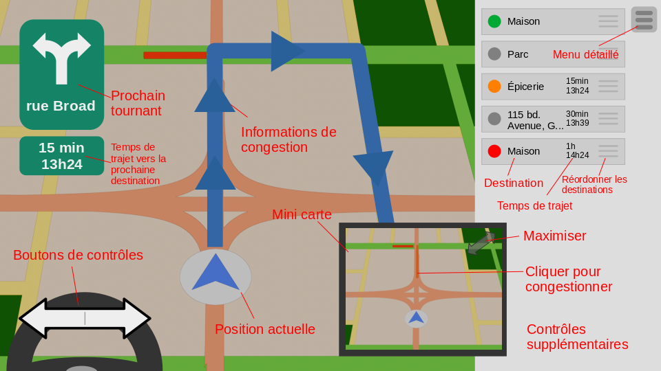

# Spécification du programme

## Description générale

Nous devons créer un système de navigation routière qui inclut un système de guidage qui peut réagir en temps réel à l'apparition de congestion.

## Liste de spécifications

- Système de réseau routier
- Système de création de réseau routier
- Interface graphique basé sur swing
- Système de navigation de la route
- Système de guidage réactif en temps réel
- Système de gestion de la congestion

## Maquette d'interface

  